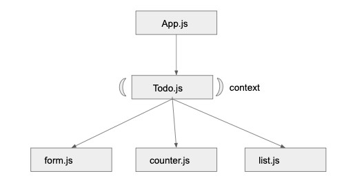

 LAB
=================================================

## Context-API ToDo List

### Author: Melissa Stock

### Links and Resources
* [submission PR](https://github.com/401-advancedjs/context-api-todo/pull/1)
* [travis](https://www.travis-ci.com/401-advancedjs/context-api-todo)
* [front-end](https://gallant-leavitt-fb9b7e.netlify.com)

### Modules
#### `app.js`
#### `todo.js`
#### `form.js`
#### `list.js`
#### `counter.js`

#### Running the app
* `npm start`
  
#### Tests
* How do you run tests?
  * `npm run test`
* What assertions were made?
  * basic rendering of all components
  * functionality makes expected changes to state on all components
  * rendering follows snapshot
* What assertions need to be / should be made?
  * none at the momment

#### UML

